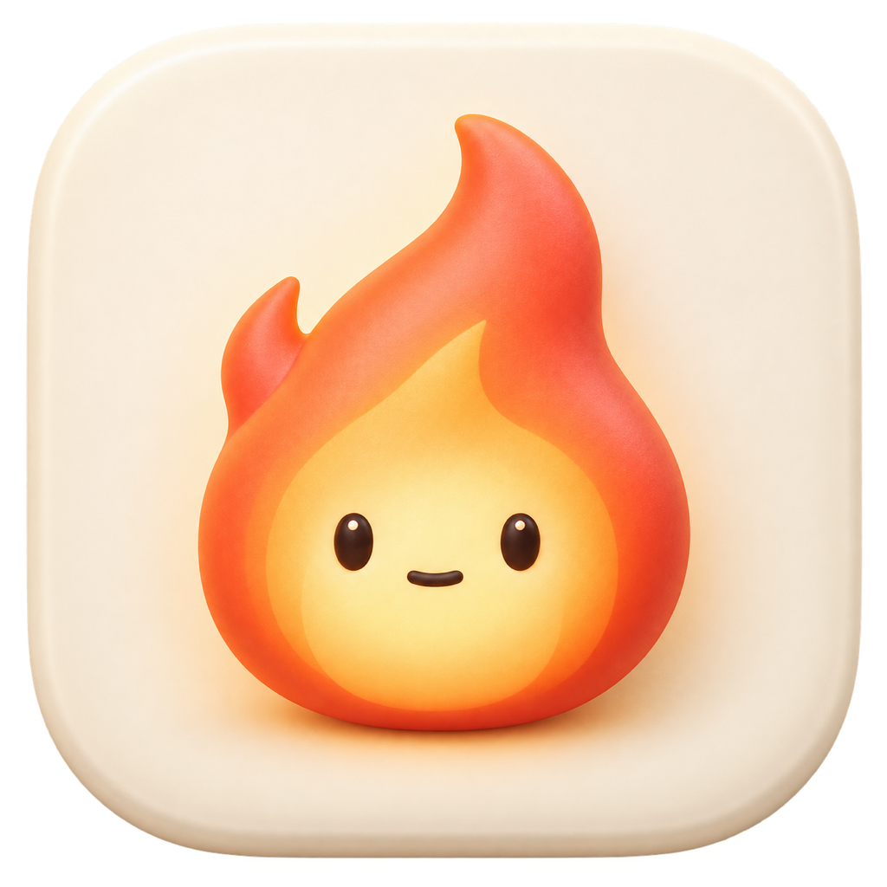
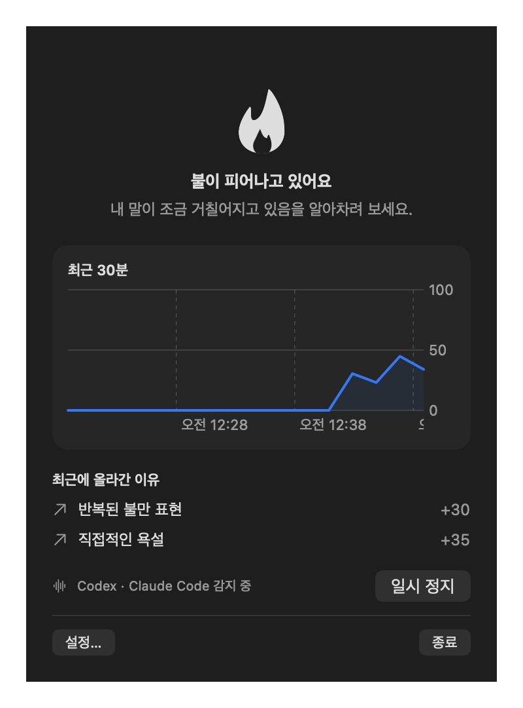

<p align="center"></p>
<h1 align="center">AngerRate</h1>
<p align="center"><strong>열이 오르는 순간을 알아차리고, 잠깐 쉬어가세요.</strong><br>Codex · Claude Code 사용자를 위한 macOS 메뉴 막대 앱</p>
<p align="center"><a href="README.md">English</a> · 한국어 · <a href="#빠른-시작">설치</a> · <a href="CONTRIBUTING.md">기여하기</a></p>
<p align="center"></p>
<p align="center"><sub>합성 데이터로 렌더링한 실제 앱 화면입니다.</sub></p>

> 초기 프리뷰 · macOS 13+ · SwiftUI · MIT · 현재 소스 빌드로 설치


AngerRate는 Codex와 Claude Code에서 내가 보낸 메시지의 언어 신호를 읽어 현재 상태를 움직이는 불꽃으로 보여 주는 macOS 메뉴 막대 앱입니다. 내부 분노 점수는 0–100이며, 100에 도달하면 한 번 알려드립니다. 점수가 50 이하로 내려간 뒤 다시 100에 도달하면 알림이 재활성화됩니다. 이 수치는 감정이나 건강 상태에 대한 진단이 아닙니다. 앱 화면과 알림은 한국어와 영어를 지원합니다.

## 빠른 시작

요구 사항은 macOS 13 이상, Swift 5.9 이상입니다. Codex 또는 Claude Code 세션 기록이 있어야 감지와 첫 진단을 사용할 수 있습니다.

```sh
git clone https://github.com/boxyhn/anger-rate.git
cd anger-rate
./scripts/package.sh
./scripts/install.sh
```

첫 명령은 `dist/AngerRate.app`과 `dist/AngerRate-0.1.0.dmg`를 만듭니다. 두 번째 명령은 앱을 `~/Applications`에 복사하고 엽니다. 기존 앱이 있으면 같은 폴더에 시각이 붙은 백업을 만든 뒤 교체합니다. DMG를 직접 열었다면 AngerRate를 Applications 링크로 드래그해도 됩니다.

현재 제공되는 바이너리는 Apple Silicon Mac에서 빌드·검증했습니다. Intel Mac에서는 소스 빌드가 필요하며 아직 검증하지 않았습니다. 기본 산출물은 Developer ID 서명과 Apple 공증을 거치지 않은 로컬 빌드입니다.

## 사용 방법

앱을 열면 메뉴 막대에 현재 점수에 맞는 단색 불꽃이 나타납니다. **촛불(0–32) → 피어나는 불(33–65) → 타오르는 불(66–100)**의 세 형태로 바뀌며, 각 구간 안에서도 점수가 높을수록 움직임이 연속적으로 빨라집니다. 메뉴를 열어 현재 점수, 최근 30분 변화, 상승 이유, 감지 상태를 볼 수 있습니다. 아무 신호가 없으면 점수가 기본 5분마다 절반으로 줄어들며, 설정에서 반감기를 2–15분 사이로 바꿀 수 있습니다.

**한·영 기본 욕설 90개는 항상 적용**됩니다. 개인화는 이 사전을 대체하지 않고, 본인 특유의 욕설 외 분노 조짐을 추가합니다. 표시하는 값은 언어 신호로 추정한 **분노 정도**입니다.

**첫 진단은 한 번의 전체 이력 점검**입니다. 설치된 도구의 현재 세션과 아카이브를 파일 처음부터 끝까지 로컬에서 읽고, 중복을 제거하며 전체 통계·반복 표현을 집계합니다. 최신 N파일이나 tail만 읽는 제한은 초기 진단에 적용하지 않습니다. 읽기 실패·손상·4MiB 초과 행은 따로 집계하고 점검 범위를 표시합니다.

모든 원문을 무제한 전송하는 대신 전체 이력에서 시기·세션별 대표 문맥 최대600개와 반복 표현 통계를 고릅니다. 이 중 최대400개 후보, 메시지당1,500자, 원문48KiB 이내와 통계를 이미 로그인된 Codex/Claude Code로 전달합니다. AI가 모든 원문을 직접 읽었다는 뜻은 아닙니다. 별도 API 키는 필요 없고 선택한 계정의 사용량이 차감될 수 있습니다. 반복 진단은 사용자가 눌렀을 때만 실행합니다.

AI가 제안한 **개인 분노 조짐**은 개인 기준 탭에서 확인·수정 후 적용합니다. 추가 신호가0개여도 정상이며 기본 욕설 감지는 유지됩니다. 진단 없이 기본 기준으로 시작할 수도 있습니다.

언어 신호는 표현별 5–50점과 가까운 시간의 반복 가산으로 계산됩니다. 인용문, 코드, 도구 결과, 에이전트 메시지, 욕설 자체에 대한 설명은 가능한 범위에서 제외하지만 자연어의 모든 맥락을 완벽히 구분하지는 못합니다.

## 여러 Mac 연결

한 대만으로 모든 기능이 동작하며 별도 서버나 회원가입이 필요 없습니다. 여러 Mac에서 합산하려면 각 Mac의 **설정 → 기기 → 동기화 폴더 선택**에서 같은 iCloud Drive 또는 다른 파일 동기화 제공자의 폴더를 선택하세요. 앱은 선택한 위치 아래 `AngerRate-Sync` 폴더에 기기별 파일을 저장합니다.

동기화에는 점수 이벤트와 개인 기준만 들어가고 메시지 원문은 들어가지 않습니다. 여러 기기의 중복 이벤트는 ID로 한 번만 계산됩니다. 이벤트는 24시간만 보존됩니다. 반영 속도는 폴더 제공자에 따라 달라지므로 두 Mac의 수치가 즉시 같아지지 않을 수 있습니다.

## 데이터 범위

- 읽기: `CODEX_HOME` 또는 `~/.codex*` 아래의 `sessions`, `archived_sessions`, `CLAUDE_CONFIG_DIR` 또는 `~/.claude/projects`의 세션 로그
- 로컬 저장: `~/Library/Application Support/AngerRate/` 아래 snapshot, 개인 기준 초안, 점검 건수·진행 정보, peer 캐시
- 선택 동기화: 사용자가 고른 폴더 아래 `AngerRate-Sync/*.json`
- 저장 내용: 점수, 감지 이유, 시각, 기기 ID, 개인 표현 기준과 반감기
- 저장하지 않는 내용: 사용자 메시지 원문

첫 진단 동안 선별한 원문은 메모리에 올라가 선택한 Codex 또는 Claude Code CLI에 전달됩니다. AngerRate의 로컬 상태나 기기 동기화 파일에는 저장되지 않습니다.

## 개발

```sh
swift test
swift run AngerRate
```

메뉴 막대 앱이라 Dock 아이콘은 표시하지 않습니다. 배포용 서명과 공증 과정은 [docs/RELEASE.md](docs/RELEASE.md)를 참고하세요.

알림은 해당 신호를 감지한 Mac에서 발송합니다. 동기화 폴더의 전파 지연 때문에 여러 Mac에서 동시에 발생한 신호에 대해 전역적으로 정확히 한 번 발송하는 것을 보장하지 않습니다. 마지막 정상 peer 상태는 로컬에 24시간 캐시하므로 일시적인 동기화 장애로 수치가 갑자기 사라지지 않습니다.

첫 진단은 접근 가능한 현재·아카이브 파일 전체를 점검하고, 진단 상태에 파일과 아카이브 메시지 수를 표시합니다. 로그인만으로 서버에만 있는 계정 대화가 내려받아지지는 않습니다. 원격 Mac에만 있는 대화 원문은 해당 Mac에서 분석해야 합니다.

## 오픈소스

코드와 저장소에 포함된 자산은 [MIT License](LICENSE)로 제공합니다. 버그 제보, 오탐 사례, 번역 기여를 환영합니다. 세션 원문 대신 개인정보를 제거한 짧은 합성 예시를 사용해 주세요. 자세한 안내는 [CONTRIBUTING.md](CONTRIBUTING.md)에 있습니다.

[RunCat](https://github.com/runcat-dev/RunCatNeo) 같은 작고 친근한 메뉴 막대 유틸리티에서 소개 방식의 영감을 받았습니다. AngerRate는 독립 프로젝트이며 아이콘은 별도로 제작했습니다.
