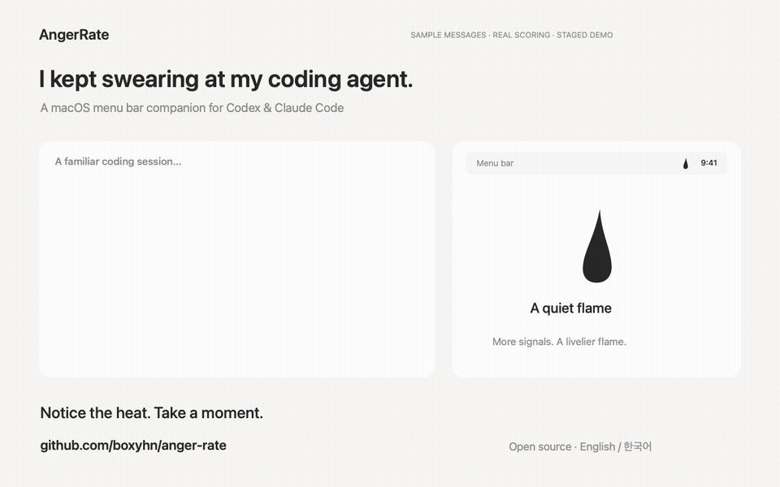
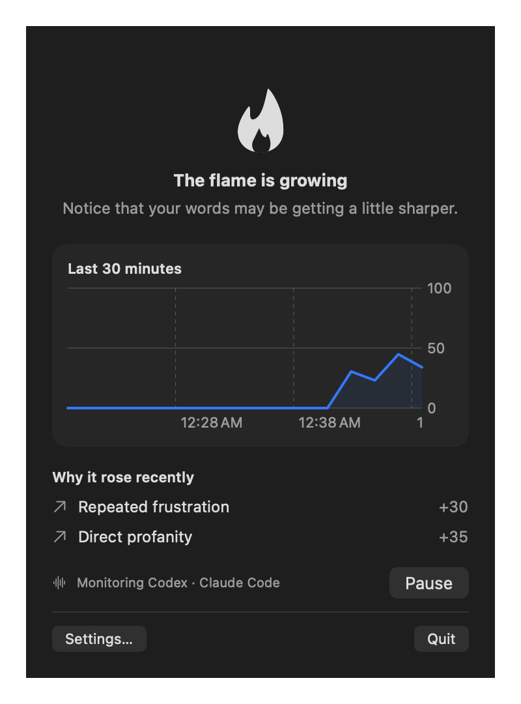

<p align="center">
  
</p>
<h1 align="center">AngerRate</h1>
<p align="center"><strong>Notice the heat. Take a moment.</strong><br>A tiny macOS menu bar companion for Codex and Claude Code.</p>
<p align="center">
  
  
  <a href="LICENSE"></a>
</p>
<p align="center">English · <a href="README.ko.md">한국어</a> · <a href="https://github.com/boxyhn/anger-rate/releases/tag/v0.1.0">Download v0.1.0</a> · <a href="#getting-started">Get started</a> · <a href="CONTRIBUTING.md">Contribute</a></p>

<p align="center"></p>
<p align="center"><sub>Staged demo using sample messages and the real scoring engine and flame renderer. Notification is illustrated; cooldown jumps ahead 10 minutes. <a href="docs/launch/anger-rate-en.mp4">Watch MP4</a>.</sub></p>
<p align="center"></p>
<p align="center"><sub>Actual app UI rendered with synthetic data.</sub></p>

Coding with an AI can get frustrating. AngerRate watches language signals in your local coding sessions and shows them as a small animated flame in your menu bar. At 100, one gentle notification gives you a moment to notice and pause.

**Preview release.** [Download v0.1.0 for Apple Silicon](https://github.com/boxyhn/anger-rate/releases/tag/v0.1.0), or build from source. The downloadable app is ad-hoc signed and not notarized.

## Small by design

- **A flame at a glance.** The monochrome animation moves from **Candle (0–32)** through **Growing flame (33–65)** to **Roaring flame (66–100)**. Motion accelerates continuously within each band.
- **One nudge at 100.** A single notification per escalation, rearmed after the internal score falls to 50 or below.
- **Your patterns, once.** Review accessible current and archived sessions with your existing Codex or Claude Code login, then review the suggested personal signals.
- **Korean + English defaults.** 90 built-in profanity expressions remain active alongside your personal criteria.
- **Korean + English interface.** AngerRate supports controls, status, and notifications in both languages.
- **One Mac is enough.** Optionally combine scored events across Macs through a folder you choose. No AngerRate account or server.

The flame represents a language-based heuristic, not a clinical assessment. Its internal score runs from 0 to 100 and cools down over time.

## Getting started

You need **macOS 13+** and local Codex or Claude Code session logs. Download the Apple Silicon DMG from the [v0.1.0 release](https://github.com/boxyhn/anger-rate/releases/tag/v0.1.0), or build it yourself with a **Swift 5.9+ toolchain**. AI personalization additionally requires a supported, signed-in CLI; it uses that account's allowance and does not need a separate API key.

Clone the public repository, then build and install it:

```sh
git clone https://github.com/boxyhn/anger-rate.git
cd anger-rate
./scripts/package.sh
./scripts/install.sh
```

This builds `dist/AngerRate.app` and `dist/AngerRate-0.1.0.dmg`, installs the app in `~/Applications`, and opens it. An existing installation is backed up before replacement. You can also drag the app from the DMG into Applications.

1. Open AngerRate from Applications and find its flame in the menu bar.
2. Start with the built-in defaults or run the one-time history review.
3. Review and apply personal criteria. Zero additional criteria is a valid result.
4. Allow notifications to receive the one-time nudge at 100.

Local builds are ad-hoc signed, not notarized. Apple Silicon has been tested; Intel and the macOS 13 minimum still need physical-device verification. Build on the target architecture. See [release notes for maintainers](docs/RELEASE.md) for signing and notarization.

## What happens to your conversations?

| Stage | What AngerRate does |
| --- | --- |
| Live detection | Reads direct user messages from local logs; matches rules and cools the score locally. No ongoing AI calls. |
| Initial review | Streams all accessible current and archived log files, deduplicates messages, and gathers coverage statistics. |
| AI personalization | Sends selected context and aggregate statistics through your chosen Codex/Claude Code CLI to its AI provider. |
| Local persistence | Stores scored events, reasons, timestamps, device IDs, audit counts, and personal phrase rules. Does not persist full message bodies. |
| Optional folder sync | Shares scored events and personal criteria, including their phrases, through your chosen folder provider. Does not sync message bodies. |

The initial review selects up to 600 representative candidates across the corpus. The CLI receives at most 400, limited to 1,500 characters per message and 48 KiB of source text, plus statistics. It does **not** send the entire history to the model. Failed reads, malformed records, and rows over 4 MiB are reported as coverage gaps.

“Whole history” means **accessible local files**, including archives. Signing in does not download cloud-only account conversations or sessions stored only on another Mac. Live discovery is limited to the most recent 4,096 files; the initial audit has no file-count cap.

Data lives in `~/Library/Application Support/AngerRate/`. Sources include `CODEX_HOME` or discovered `~/.codex*` session directories, and `CLAUDE_CONFIG_DIR` or `~/.claude/projects`. Original session logs are read-only.

## More than one Mac

On each Mac, choose the same synced folder in **Settings → Devices**. AngerRate writes per-device snapshots under `AngerRate-Sync` and deduplicates event IDs. Events and the last healthy peer cache are retained for 24 hours.

Sync speed depends on your folder provider. Notifications originate on the Mac that detects the signal; simultaneous activity on disconnected Macs cannot guarantee exactly one notification globally.

## Development

Native SwiftUI, Swift Charts, Foundation, and UserNotifications. No third-party package dependencies.

```sh
swift test
swift run AngerRate
./scripts/package.sh
```

| Location | Responsibility |
| --- | --- |
| `Sources/AngerCore` | Session parsing, history audit, language rules, scoring, CLI personalization, sync |
| `Sources/AngerRate` | Menu bar UI, settings, notifications, app lifecycle |
| `Tests/AngerCoreTests` | Synthetic fixtures and behavior tests |
| `assets` | Original app icon and provenance |
| `scripts` | Reproducible icon, app, and DMG packaging |

Read [the design](docs/DESIGN.md), [verification and remaining gaps](docs/VERIFICATION.md), or [contribution guide](CONTRIBUTING.md). Logs are not a stable public API, and context matching can produce false positives. Sanitized reproductions are especially helpful.

## License & inspiration

[MIT](LICENSE). Contributions, language improvements, and small usability fixes are welcome.

Inspired by the approachable, focused menu bar utility spirit of [RunCat](https://github.com/runcat-dev/RunCatNeo). AngerRate is an independent project with original artwork; it is not affiliated with RunCat, OpenAI, or Anthropic.
